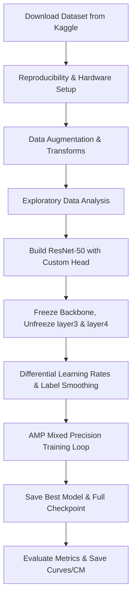

# AgriDoc: Tomato Leaf Disease Classification (CNN Training Pipeline)

This repository contains the training pipeline and model definitions for **AgriDoc**, a computer vision-based system designed to classify tomato leaf diseases. The pipeline leverages transfer learning with a custom-head **ResNet-50** architecture, optimized with state-of-the-art deep learning techniques.

---

## 📂 Project Structure

The project is structured as follows:

```plaintext
AgriDoc_CNN_Training/
├── dataset/                        # Dataset directory (created automatically; ignored by git)
│   └── tomato/
│       ├── train/                  # Training set split by class (10 directories)
│       └── val/                    # Validation set split by class (10 directories)
├── models/                         # Saved PyTorch models/checkpoints (ignored by git)
│   ├── best_resnet50_tomato.pth    # Weights of the best model based on validation loss
│   └── resnet50_tomato_full.pth    # Full model checkpoint (state dict, optimizer, scheduler, etc.)
├── outputs/                        # Visualizations and metrics generated during evaluation
│   ├── accuracy_loss_curve.png     # Training vs Validation accuracy and loss curves
│   ├── confusion_matrix.png        # Validation set confusion matrix (normalized)
│   └── random_predictions.png      # Grid of sample validation images with predicted/true labels
├── .venv/                          # Python virtual environment (ignored by git)
├── .gitignore                      # Specifies folders ignored by Git (dataset/, models/)
├── requirements.txt                # Python environment package dependencies
└── Training_Pipeline.ipynb         # Main Jupyter Notebook containing the end-to-end training pipeline
```

---

## 📊 Dataset & Diseases

The pipeline uses the **Tomato Leaf** dataset sourced from Kaggle (`kaustubhb999/tomatoleaf`), containing images classified into **10 distinct categories**:

1.  `Tomato___Bacterial_spot`
2.  `Tomato___Early_blight`
3.  `Tomato___Late_blight`
4.  `Tomato___Leaf_Mold`
5.  `Tomato___Septoria_leaf_spot`
6.  `Tomato___Spider_mites Two-spotted_spider_mite`
7.  `Tomato___Target_Spot`
8.  `Tomato___Tomato_Yellow_Leaf_Curl_Virus`
9.  `Tomato___Tomato_mosaic_virus`
10. `Tomato___healthy`

---

## 🛠️ Training Pipeline Overview

The training pipeline implemented in `Training_Pipeline.ipynb` follows a modern deep learning workflow:



### 1. Reproducibility & CUDA Config
To ensure consistent runs, random seeds are set for `random`, `numpy`, and `torch` (CPU and GPU), alongside disabling CuDNN benchmarks. Hardware detection automatically provisions GPU execution and supports multi-GPU scaling via `torch.nn.DataParallel`.

### 2. Preprocessing & Data Augmentation
To prevent overfitting and improve generalization, train-time transforms are heavily augmented:
*   **Input Dimensions**: All images are resized and cropped to `224 × 224` pixels.
*   **Normalization**: Pixel values are normalized using ImageNet stats:
    *   Mean: `[0.485, 0.456, 0.406]`
    *   Std Dev: `[0.229, 0.224, 0.225]`
*   **Train Augmentations**:
    *   `RandomResizedCrop` (scale `0.6` to `1.0`, aspect ratio `0.75` to `1.33`)
    *   `RandomHorizontalFlip` ($p=0.5$), `RandomVerticalFlip` ($p=0.2$)
    *   `ColorJitter` (brightness, contrast, saturation, and hue)
    *   `RandomAffine` (rotation up to $15^\circ$, translation, scaling)

### 3. Model Architecture
The network is built upon a pre-trained **ResNet-50 (IMAGENET1K_V2)** backbone.
*   **Frozen layers**: Early feature-extraction layers are frozen to retain pre-trained weights.
*   **Unfrozen layers**: Fine-tuning is enabled on `layer3` and `layer4` of the backbone to adapt higher-level semantic features to leaf anatomy.
*   **Custom Head**:
    $$\text{ResNet-50 Features (2048)} \to \text{Linear(1024)} \to \text{BatchNorm1d} \to \text{ReLU} \to \text{Dropout(0.4)} \to \text{Linear(512)} \to \text{BatchNorm1d} \to \text{ReLU} \to \text{Dropout(0.3)} \to \text{Linear(10)}$$

### 4. Loss, Optimization, and Scheduling
*   **Label Smoothing Cross-Entropy**: Implemented with a smoothing factor of `0.1` to reduce overconfidence and improve model calibration.
*   **Differential Learning Rates**:
    *   Backbone parameters: $\text{LR} \times 0.1 = 3 \times 10^{-5}$
    *   Custom Classification Head parameters: $\text{LR} = 3 \times 10^{-4}$
*   **Optimizer**: `AdamW` (Weight Decay: $1 \times 10^{-4}$)
*   **Learning Rate Scheduler**: `CosineAnnealingWarmRestarts` (with $T_0=10, T_{\text{mult}}=2, \eta_{\text{min}}=1 \times 10^{-6}$)
*   **Precision**: Automatic Mixed Precision (`torch.cuda.amp.GradScaler`) is integrated to reduce VRAM consumption and speed up training.

---

## 📈 Getting Started

### Prerequisites

*   Python 3.8 or higher
*   NVIDIA GPU with CUDA installed (highly recommended)

### Setup

1.  **Clone the repository and enter directory**:
    ```bash
    git clone <repository_url>
    cd tomato_disease_classification
    ```

2.  **Set up virtual environment & install requirements**:
    ```bash
    python3 -m venv .venv
    source .venv/bin/activate
    pip install -r requirements.txt
    ```

3.  **Run the Training Pipeline**:
    Open the Jupyter Notebook and run all cells:
    ```bash
    jupyter notebook Training_Pipeline.ipynb
    ```

    The dataset will automatically download from Kaggle using `kagglehub`. Ensure you have internet access during the first execution.

---

## 🏆 Outputs & Performance Visualizations

Once training completes, the following files are saved in the `outputs/` directory:
*   `accuracy_loss_curve.png`: Plots showing validation and training progression.
*   `confusion_matrix.png`: Normalized confusion matrix highlighting per-class recall and misclassifications.
*   `random_predictions.png`: Visual verification of model predictions on random validation leaf samples.
